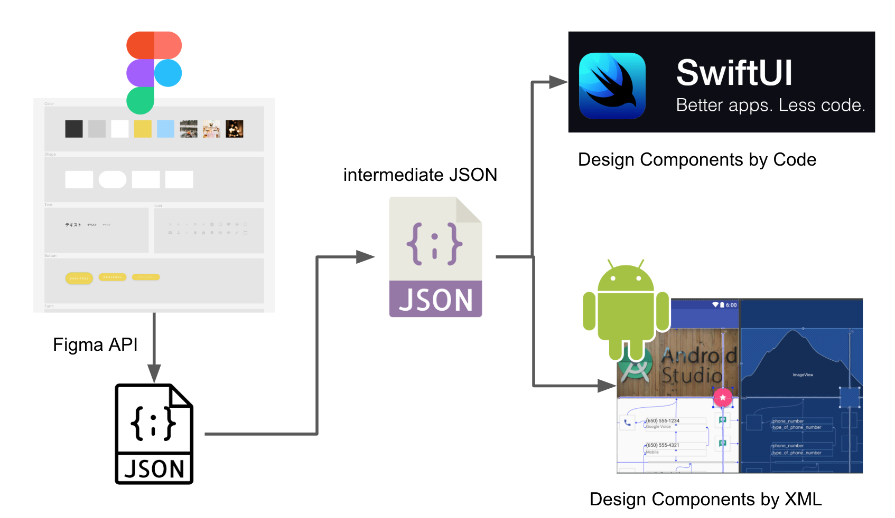

## Figma to SwiftUI

https://github.com/mitolog/figma-to-swiftui

---
<!-- sectionTitle: What is it? -->
## What is it?

---
## The concept

---
## What I'm trying to do is...

- to generate design parts library automatically
- to generate layout (if possible)

---
<!-- sectionTitle: Demo -->
## Demo

---
## Step by step

 - How SwiftUI works
 -
